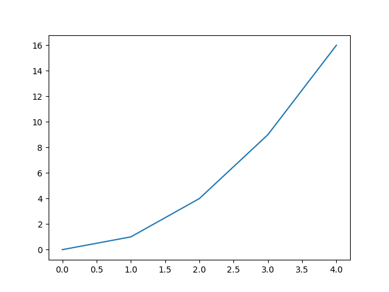

第 2 回では Python のライブラリ [Matplotlib](https://matplotlib.org/) を用いたデータ可視化について学びます。

## 2.1 データ可視化の重要性

データ可視化は、複雑なデータを直感的に理解するために重要なプロセスです。文字や数値だけで表現されたデータは、そのままでは意味を捉えにくいことがありますが、グラフやチャートを用いて適切に可視化することにより、データの傾向やパターンを迅速に把握することが可能となります。さらには、高精度な分析や、意思決定の効果的なサポートにも繋がります。

### 2.1.1 Python によるデータ可視化

Python には、データ可視化を行うためなツールがさまざま提供されています。特に、オープンソースのライブラリである `Matplotlib` や `Seaborn` は、柔軟で詳細なカスタマイズが可能なグラフ作成を強力にサポートしてくれます。これらのライブラリを使用することで、簡単な散布図から複雑なヒートマップや 3D プロットまで、多種多様な可視化を容易に実現できます。

今回学ぶ `Matplotlib` は、Python で最も広く使われている定番の可視化ライブラリです。細かいカスタマイズが自由自在にできる反面、最初は少し面倒に感じるところもあるかもしれませんが、Python によるデータ可視化を学ぶうえで欠かせません。

公式：[https://matplotlib.org/](https://matplotlib.org/)

!!! info "ライブラリのインストールについて"

    通常、このような可視化ライブラリは `pip` コマンドでインストールする必要がありますが、**CHIKUWA Editor には予めインストール済み**ですので、特別な操作は不要です。外部の開発環境を利用する場合は、必要に応じて各自でインストールしてください。

## 2.2 Matplotlib の基本

### 2.2.1 Matplotlib のインポート

`Matplotlib` による可視化は、`pyplot` というサブモジュールを通して行われます。インポートは以下のようにして行います。ソースコードの冒頭で一度だけ書くようにしましょう。

```python
import matplotlib.pyplot as plt
```

以下で紹介するコードは、`matplotlib.pyplot` モジュールがインポートされ、`plt` という省略表記で利用できる状態であることを前提としています。

## 2.3 基本的なグラフの描画

### 2.3.1 折れ線グラフ

データをプロットして折れ線グラフを表示するには、以下のように [`pyplot.plot()`](https://matplotlib.org/stable/api/_as_gen/matplotlib.pyplot.plot.html#matplotlib.pyplot.plot) 関数と [`pyplot.show()`](https://matplotlib.org/stable/api/_as_gen/matplotlib.pyplot.show.html) 関数を用います。

```python
# x の値（横軸）
x = [0, 1, 2, 3, 4]

# y の値（縦軸）
y = [0, 1, 4, 9, 16]

# データをプロット
plt.plot(x, y)

# グラフの表示
plt.show()
```



以下のように 1 行に収めることもできます。

```python
plt.plot([1, 2, 3], [1, 4, 9])
```

!!! info "`plt.show()` の省略について"

    本来の Python では、`plt.plot()` 関数のあとに `plt.show()` 関数を用いてグラフを表示する必要があります。しかし、CHIKUWA Editor や Google Colab は `plot()` を見つけると、「グラフを出力したいんだ」と解釈し、裏で自動的に `show()` 相当のことをしてくれるため、記述を省略することができます。

### 2.3.2 棒グラフ

棒グラフを表示するには、[`pyplot.bar()`](https://matplotlib.org/stable/api/_as_gen/matplotlib.pyplot.bar.html) 関数を用います。

```python
plt.bar(["A", "B", "C", "D"], [5, 7, 3, 12])
```


横向きの棒グラフを表示する場合は、[`pyplot.barh()`](https://matplotlib.org/stable/api/_as_gen/matplotlib.pyplot.barh.html) 関数を用います。

```python
plt.barh(["A", "B", "C", "D"], [5, 7, 3, 12])
```


### 2.3.3 散布図

散布図を表示するには、[`pyplot.scatter()`](https://matplotlib.org/stable/api/_as_gen/matplotlib.pyplot.scatter.html) 関数を用います。

```python
plt.scatter([1, 3, 8, 5], [3, 6, 8, 4])
```


### 2.3.4 円グラフ

円グラフを表示するには、[`pyplot.pie()`](https://matplotlib.org/stable/api/_as_gen/matplotlib.pyplot.pie.html) 関数を用います。各要素にラベルをつける場合は、以下のように `labels` オプションを指定します。

```python
plt.pie([25, 35, 40], labels=["Good", "Normal", "Bad"])
```


デフォルトでは上の図のように、時計の 3 時の位置から反時計回りに円グラフが描かれます。これを、時計の 12 時の位置から時計回りに描きたい場合は、以下のように `startangle` オプションを `90` に、`counterclock` オプションを `False` に指定します。

```python
plt.pie(
    [25, 35, 40],
    labels=["Good", "Normal", "Bad"],
    startangle=90,
    counterclock=False,
)
```


### 2.3.5 ヒストグラム

ヒストグラムを表示するには、[`pyplot.hist()`](https://matplotlib.org/stable/api/_as_gen/matplotlib.pyplot.hist.html) 関数を用います。ヒストグラムではデータの他に、区間（ビン）の数（`bins`）やビンの色（`color`, `edgecolor`）を指定することができます。

```python
import numpy as np
import matplotlib.pyplot as plt

# 標準正規分布のデータを 300 個生成
data = np.random.randn(300)

# ヒストグラムを描画
plt.hist(
    data,
    bins=20,
    color="skyblue",
    edgecolor="black"
)
plt.xlabel("Value")
plt.ylabel("Frequency")
plt.show()
```


### 2.3.6 グラフの基本要素

グラフの基本要素として、次のものがあります。

- 「タイトル 」(`title`)
- 「横軸ラベル」(`xlabel`)
- 「縦軸ラベル」(`ylabel`)
- 「グリッド線」(`grid`)
- 「凡例」(`legend`)

それぞれ以下のようにして使うことができます。

```python
plt.plot(
    [1, 2, 3], [1, 4, 9],
    label="Sugoi Sen"      # 凡例のラベル
)
plt.title("Kakkoii Graph") # グラフタイトル
plt.xlabel("Yoko Label")   # 横軸ラベル
plt.ylabel("Tate Label")   # 縦軸ラベル
plt.grid(True)             # グリッド線の表示
plt.legend()               # 凡例の表示
```


### 2.3.7 日本語フォントの利用

グラフのタイトルや軸ラベルに日本語を使いたい場合は、`rcParams["font.family"]` で日本語フォントを指定します。一般的な Python 環境では日本語フォントはインストールされていませんが、CHIKUWA Editor では `Noto Sans CJK JP` をインストール済みですので、以下のようにして使うことができます。

```python
plt.rcParams["font.family"] = "Noto Sans CJK JP"
```

日本語フォントを指定した状態であれば、以下のようにグラフのタイトルや軸ラベルに日本語を使うことができます。


rcParams: [https://matplotlib.org/stable/api/matplotlib_configuration_api.html#matplotlib.rcParams](https://matplotlib.org/stable/api/matplotlib_configuration_api.html#matplotlib.rcParams)

## 2.4 NumPy の関数

データ可視化の練習をするうえで知っておくと便利な `NumPy` の関数をいくつか紹介します。必要に応じて [NumPy 公式](https://numpy.org/ja/) のドキュメントを参照するようにしてください。

### 2.4.1 データ生成系

- [`np.linspace(start, stop, num)`](https://numpy.org/doc/stable/reference/generated/numpy.linspace.html#numpy-linspace)：
  指定範囲内で等間隔な値の配列を生成
- [`np.arange(start, stop, step)`](https://numpy.org/doc/stable/reference/generated/numpy.arange.html)：
  指定範囲内でステップ幅を持つ配列を生成
- [`np.random.rand()`](https://numpy.org/doc/stable/reference/random/generated/numpy.random.rand.html#numpy-random-rand)：
  一様分布の乱数を生成
- [`np.random.randn()`](https://numpy.org/doc/stable/reference/random/generated/numpy.random.randn.html#numpy-random-randn)：
  標準正規分布の乱数を生成
- [`np.random.normal()`](https://numpy.org/doc/stable/reference/random/generated/numpy.random.normal.html#numpy-random-normal)：
  正規分布の乱数を生成
- [`np.random.seed()`](https://numpy.org/doc/stable/reference/random/generated/numpy.random.seed.html#numpy-random-seed)：
  乱数のシード値を設定（再現性のある乱数を生成したい場合）
- [`np.zeros()`](https://numpy.org/doc/stable/reference/generated/numpy.zeros.html#numpy.zeros)：
  0 で満たされた配列を作成
- [`np.ones()`](https://numpy.org/doc/stable/reference/generated/numpy.ones.html#numpy.ones)：
  1 で満たされた配列を作成

### 2.4.2 数学・統計系

- `np.sin()`, `np.cos()`, `np.exp()`：さまざまな数学関数
- `np.mean()`, `np.median()`, `np.std()`：基本統計量の計算
- `np.min()`, `np.max()`：最小値・最大値の取得
- `np.pi`：円周率 π

## 演習

!!! tip "演習 2-1"

    日本を含む3ヶ国以上の国別の人口データを調査し、棒グラフ（単位：百万人）を作成してください。

!!! tip "演習 2-2"

    `np.random.rand()` 関数を用いて24個のランダムな数値を生成し、それを仮想的な24時間分の気温データ（単位：℃）として、折れ線グラフで可視化してください。ただし、現実的な気温の範囲を考慮してください。

!!! tip "演習 2-3"

    ボールの自由落下のシミュレーションを行い、時間に対する高さのグラフを描いてください。ただし、ボールの高さが 0 未満にならないよう注意してください。
