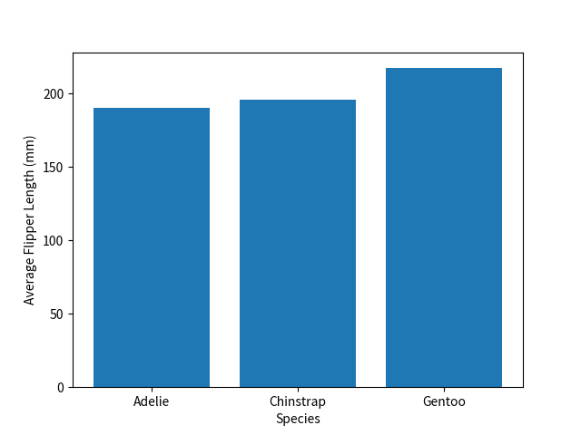

第 6 回では pandas を用いたデータの前処理について学びます。

## 6.1 データの確認

まずは、読み込んだデータ（DataFrame）を確認する方法について、おさらいしましょう。以下では、Seaborn の `penguins` データセットを例に、各種操作の紹介をしていきます。

### 6.1.1 データの先頭を確認

DataFrame の先頭数行を確認したい場合は、[`DataFrame.head()`](https://pandas.pydata.org/docs/reference/api/pandas.DataFrame.head.html) 関数を用います。この関数は、データの構造や形式を素早く把握したい際に便利です。デフォルトでは先頭 5 行が表示されますが、引数に数字を入れると表示したい行数を指定することができます。

```python
import pandas as pd
import seaborn as sns

# penguins データセットの読み込み
df = sns.load_dataset("penguins")

# データの先頭5行を表示
print("【先頭5行】\n", df.head())

# データの先頭10行を表示
print("\n【先頭10行】\n", df.head(10))
```

```title="Output"
【先頭5行】
   species     island  bill_length_mm  ...  flipper_length_mm  body_mass_g     sex
0  Adelie  Torgersen            39.1  ...              181.0       3750.0    Male
1  Adelie  Torgersen            39.5  ...              186.0       3800.0  Female
2  Adelie  Torgersen            40.3  ...              195.0       3250.0  Female
3  Adelie  Torgersen             NaN  ...                NaN          NaN     NaN
4  Adelie  Torgersen            36.7  ...              193.0       3450.0  Female

[5 rows x 7 columns]

【先頭10行】
   species     island  bill_length_mm  ...  flipper_length_mm  body_mass_g     sex
0  Adelie  Torgersen            39.1  ...              181.0       3750.0    Male
1  Adelie  Torgersen            39.5  ...              186.0       3800.0  Female
2  Adelie  Torgersen            40.3  ...              195.0       3250.0  Female
3  Adelie  Torgersen             NaN  ...                NaN          NaN     NaN
4  Adelie  Torgersen            36.7  ...              193.0       3450.0  Female
5  Adelie  Torgersen            39.3  ...              190.0       3650.0    Male
6  Adelie  Torgersen            38.9  ...              181.0       3625.0  Female
7  Adelie  Torgersen            39.2  ...              195.0       4675.0    Male
8  Adelie  Torgersen            34.1  ...              193.0       3475.0     NaN
9  Adelie  Torgersen            42.0  ...              190.0       4250.0     NaN

[10 rows x 7 columns]
```

また、データの末尾を表示したい場合は、[`DataFrame.tail()`](https://pandas.pydata.org/docs/reference/api/pandas.DataFrame.tail.html) 関数を用います。

### 6.1.2 データの情報を確認

DataFrame の全体的な情報を確認したい場合は、[`DataFrame.info()`](https://pandas.pydata.org/docs/reference/api/pandas.DataFrame.info.html) 関数を用います。各列のデータ型や、非 null (non-null) の値の数などを確認できるため、データの概要や前処理の必要性を把握するのに役立ちます。

```python title="データの全体的な情報を表示"
print(df.info())
```

```title="Output"
RangeIndex: 344 entries, 0 to 343
Data columns (total 7 columns):
 #   Column             Non-Null Count  Dtype
---  ------             --------------  -----
 0   species            344 non-null    object
 1   island             344 non-null    object
 2   bill_length_mm     342 non-null    float64
 3   bill_depth_mm      342 non-null    float64
 4   flipper_length_mm  342 non-null    float64
 5   body_mass_g        342 non-null    float64
 6   sex                333 non-null    object
dtypes: float64(4), object(3)
memory usage: 18.9+ KB
None
```

### 6.1.3 データの統計情報を表示

数値データに関する統計情報を確認するには、[`DataFrame.describe()`](https://pandas.pydata.org/docs/reference/api/pandas.DataFrame.describe.html) 関数を用います。この関数により、平均値 (mean) や 標準偏差 (std)、最小値 (min)、最大値 (max) など、基本的な統計情報を確認することができます。

```python title="データの統計情報を確認"
print(df.describe())
```

```title="Output"
       bill_length_mm  bill_depth_mm  flipper_length_mm  body_mass_g
count      342.000000     342.000000         342.000000   342.000000
mean        43.921930      17.151170         200.915205  4201.754386
std          5.459584       1.974793          14.061714   801.954536
min         32.100000      13.100000         172.000000  2700.000000
25%         39.225000      15.600000         190.000000  3550.000000
50%         44.450000      17.300000         197.000000  4050.000000
75%         48.500000      18.700000         213.000000  4750.000000
max         59.600000      21.500000         231.000000  6300.000000
```

### 6.1.4 列名の一覧表示

DataFrame の列名の一覧を確認するには、[`DataFrame.columns`](https://pandas.pydata.org/docs/reference/api/pandas.DataFrame.columns.html) を用います。

```python title="列名の一覧を表示"
print(df.columns)
```

```title="Output"
Index(['species', 'island', 'bill_length_mm', 'bill_depth_mm',
       'flipper_length_mm', 'body_mass_g', 'sex'],
      dtype='object')
```

### 6.1.5 特定の列を選択

特定の列を選択するには、ブラケット (`[]`) を用いて列名を指定します。このようにして選択したデータは、Series となります。

```python title="特定の列を選択"
print(df["bill_length_mm"])
```

```title="Output"
0      39.1
1      39.5
2      40.3
3       NaN
4      36.7
       ...
339     NaN
340    46.8
341    50.4
342    45.2
343    49.9
Name: bill_length_mm, Length: 344, dtype: float64
```

### 6.1.6 ユニークな要素の確認

データ列に含まれるユニークな要素の一覧を確認したい場合は [`Series.unique()`](https://pandas.pydata.org/docs/reference/api/pandas.Series.unique.html) 関数を、その頻度を確認したい場合 [`Series.value_counts()`](https://pandas.pydata.org/docs/reference/api/pandas.Series.value_counts.html) 関数を用います。

```python title="ユニークな要素の確認"
print(df["species"].unique())
print(df["species"].value_counts())
```

```title="Output"
['Adelie' 'Chinstrap' 'Gentoo']

species
Adelie       152
Gentoo       124
Chinstrap     68
Name: count, dtype: int64
```

## 6.2 欠損値の処理

データの前処理において、特に重要な役割を持つのが、欠損値の処理です。ここでは、pandas を使って欠損値を効率的に取り扱う方法を紹介します。

### 6.2.1 欠損値の検出

欠損値や欠損値でないデータの数を確認するには、[`DataFrame.isnull()`](https://pandas.pydata.org/docs/reference/api/pandas.DataFrame.isnull.html) 関数 や [`DataFrame.notnull()`](https://pandas.pydata.org/docs/reference/api/pandas.DataFrame.notnull.html) 関数を用います。ここで `null` とは、データが存在しないことを意味するプログラミング用語を指します。

- [`DataFrame.isnull()`](https://pandas.pydata.org/docs/reference/api/pandas.DataFrame.isnull.html): 欠損値を持つ場所を True として示します。
- [`DataFrame.notnull()`](https://pandas.pydata.org/docs/reference/api/pandas.DataFrame.notnull.html): 欠損値でない場所を True として示します。

以下は `isnull()` 関数を使用して欠損値を検出する例です。`True` となっている場所が欠損値で、元のデータを確認すると `NaN` (Not a Number) となっていることがわかります。

```python title="欠損値の検出"
print(df.isnull())
```

```title="Output"
     species  island  bill_length_mm  ...  flipper_length_mm  body_mass_g    sex
0      False   False           False  ...              False        False  False
1      False   False           False  ...              False        False  False
2      False   False           False  ...              False        False  False
3      False   False            True  ...               True         True   True
4      False   False           False  ...              False        False  False
..       ...     ...             ...  ...                ...          ...    ...
339    False   False            True  ...               True         True   True
340    False   False           False  ...              False        False  False
341    False   False           False  ...              False        False  False
342    False   False           False  ...              False        False  False
343    False   False           False  ...              False        False  False

[344 rows x 7 columns]
```

欠損値の数をカウントするには、[`DataFrame.sum()`](https://pandas.pydata.org/docs/reference/api/pandas.DataFrame.sum.html) 関数を組み合わせて以下のように書きます。各列の欠損値の数が表示され、`sex` の欠損値が `11` と最も多いことがわかります。

```python title="各列の欠損値をカウント"
print(df.isnull().sum())
```

```title="Output"
species               0
island                0
bill_length_mm        2
bill_depth_mm         2
flipper_length_mm     2
body_mass_g           2
sex                  11
dtype: int64
```

以下は、`notnull()` 関数を用いて非欠損値の検出を行う例です。

```python
# 非欠損値の検出
print(df.notnull())

# 各列の非欠損値をカウント
print(df.notnull().sum())
```

```title="Output"
     species  island  bill_length_mm  ...  flipper_length_mm  body_mass_g    sex
0       True    True            True  ...               True         True   True
1       True    True            True  ...               True         True   True
2       True    True            True  ...               True         True   True
3       True    True           False  ...              False        False  False
4       True    True            True  ...               True         True   True
..       ...     ...             ...  ...                ...          ...    ...
339     True    True           False  ...              False        False  False
340     True    True            True  ...               True         True   True
341     True    True            True  ...               True         True   True
342     True    True            True  ...               True         True   True
343     True    True            True  ...               True         True   True

[344 rows x 7 columns]

species              344
island               344
bill_length_mm       342
bill_depth_mm        342
flipper_length_mm    342
body_mass_g          342
sex                  333
dtype: int64
```

### 6.2.2 欠損値の除去

欠損値が存在する場合、正しいデータ分析や可視化が行えなくなる可能性があるため、何らかの処理が求められます。最も簡単な対処法の一つは、欠損値を含む行や列のデータを削除するというものです。

欠損値を含む行を削除するには、[`DataFrame.dropna()`](https://pandas.pydata.org/docs/reference/api/pandas.DataFrame.dropna.html) 関数を用います。ここで `na` は、`Not Available`（使えないデータ）の意味を表します。

```python title="欠損値を含む行の除去"
print(df.dropna())
```

```title="Output"
    species     island  bill_length_mm  ...  flipper_length_mm  body_mass_g     sex
0    Adelie  Torgersen            39.1  ...              181.0       3750.0    Male
1    Adelie  Torgersen            39.5  ...              186.0       3800.0  Female
2    Adelie  Torgersen            40.3  ...              195.0       3250.0  Female
4    Adelie  Torgersen            36.7  ...              193.0       3450.0  Female
5    Adelie  Torgersen            39.3  ...              190.0       3650.0    Male
..      ...        ...             ...  ...                ...          ...     ...
338  Gentoo     Biscoe            47.2  ...              214.0       4925.0  Female
340  Gentoo     Biscoe            46.8  ...              215.0       4850.0  Female
341  Gentoo     Biscoe            50.4  ...              222.0       5750.0    Male
342  Gentoo     Biscoe            45.2  ...              212.0       5200.0  Female
343  Gentoo     Biscoe            49.9  ...              213.0       5400.0    Male

[333 rows x 7 columns]
```

`dropna()` 関数により、データの行数が `344` から `333` となり、11 行削除されていることがわかります。

### 6.2.3 欠損値の補完

欠損値へのもう一つの対処法として、データの補完がよく用いられます。欠損値を、指定のデータ、または平均値・中央値・最頻値などに置き換え、もっともらしい（自然な）データにするというものです。

#### すべての欠損値を指定のデータで補完

すべての欠損値を指定のデータで補完するには、[`DataFrame.fillna()`](https://pandas.pydata.org/docs/reference/api/pandas.DataFrame.fillna.html) 関数を用います。補完後のデータは、引数で指定することができます。すべての欠損値を `0` で補完するには、以下のようにします。

```python title="すべての欠損値を 0 で補完"
print(df.fillna(0))
```

```title="Output"
    species     island  bill_length_mm  ...  flipper_length_mm  body_mass_g     sex
0    Adelie  Torgersen            39.1  ...              181.0       3750.0    Male
1    Adelie  Torgersen            39.5  ...              186.0       3800.0  Female
2    Adelie  Torgersen            40.3  ...              195.0       3250.0  Female
3    Adelie  Torgersen             0.0  ...                0.0          0.0       0
4    Adelie  Torgersen            36.7  ...              193.0       3450.0  Female
..      ...        ...             ...  ...                ...          ...     ...
339  Gentoo     Biscoe             0.0  ...                0.0          0.0       0
340  Gentoo     Biscoe            46.8  ...              215.0       4850.0  Female
341  Gentoo     Biscoe            50.4  ...              222.0       5750.0    Male
342  Gentoo     Biscoe            45.2  ...              212.0       5200.0  Female
343  Gentoo     Biscoe            49.9  ...              213.0       5400.0    Male
```

#### 特定の列の欠損値を補完

特定の列の欠損値を補完するには、以下のように列を指定したうえで `fillna()` 関数を使用します。

```python title="特定の列の欠損値を補完"
# bill_length_mm 列の欠損値を 0 で補完
print(df["bill_length_mm"].fillna(0))

# sex 列の欠損値を "Other" で補完
print(df["sex"].fillna("Other"))
```

```title="Output"
0      39.1
1      39.5
2      40.3
3       0.0
4      36.7
       ...
339     0.0
340    46.8
341    50.4
342    45.2
343    49.9
Name: bill_length_mm, Length: 344, dtype: float64

0        Male
1      Female
2      Female
3       Other
4      Female
        ...
339     Other
340    Female
341      Male
342    Female
343      Male
Name: sex, Length: 344, dtype: object
```

#### 平均値・中央値・最頻値 の利用

数値データの単純な補完には、よく平均値や中央値、最頻値が使われます。平均値は [`mean()`](https://pandas.pydata.org/docs/reference/api/pandas.Series.mean.html) 関数、中央値は [`median()`](https://pandas.pydata.org/docs/reference/api/pandas.Series.median.html) 関数、最頻値は [`mode()`](https://pandas.pydata.org/docs/reference/api/pandas.Series.mode.html) 関数で求めることができます。ここで `mode()` は、複数の最頻値を返す可能性があるため（加えて戻り値が Series データであるため）、`[0]` をつけてデータの先頭行を取り出す必要があります。

```python
print("平均値", df["bill_length_mm"].mean())
print("中央値", df["bill_length_mm"].median())
print("最頻値", df["bill_length_mm"].mode()[0])
```

```title="Output"
平均値 43.9219298245614
中央値 44.45
最頻値 41.1
```

!!! note "数値データとカテゴリカルデータ"

    平均値や中央値は数値データにしか使うことができませんが、最頻値はカテゴリカルデータ（カテゴリデータ）にも使うことができます。

#### 前後の値を用いた補完（補間）

時系列データなど、並びに意味のあるデータである場合、前後の値を用いた補完（補間）が役立ちます。

- [`DataFrame.ffill()`](https://pandas.pydata.org/docs/reference/api/pandas.DataFrame.ffill.html): 直前 (forward) の値で欠損値を埋めます。
- [`DataFrame.bfill()`](https://pandas.pydata.org/docs/reference/api/pandas.DataFrame.bfill.html): 直後 (backward) の値で欠損値を埋めます。
- [`DataFrame.interpolate()`](https://pandas.pydata.org/docs/reference/api/pandas.DataFrame.interpolate.html): 前後の値を用いて線形補間 (interpolation) します。

```python title="前後の値を用いた補完（補間）"
# 直前の値で補完
print(df["bill_length_mm"].ffill())

# 直後の値で補完
print(df["bill_length_mm"].bfill())

# 線形補間
print(df["bill_length_mm"].interpolate())
```

```title="Output"
0      39.1
1      39.5
2      40.3
3      40.3
4      36.7
       ...
339    47.2
340    46.8
341    50.4
342    45.2
343    49.9
Name: bill_length_mm, Length: 344, dtype: float64

0      39.1
1      39.5
2      40.3
3      36.7
4      36.7
       ...
339    46.8
340    46.8
341    50.4
342    45.2
343    49.9
Name: bill_length_mm, Length: 344, dtype: float64

0      39.1
1      39.5
2      40.3
3      38.5
4      36.7
       ...
339    47.0
340    46.8
341    50.4
342    45.2
343    49.9
Name: bill_length_mm, Length: 344, dtype: float64
```

### 6.2.4 データ補完時の注意

ここまでで欠損値の除去や補完について説明してきましたが、`dropna()` 関数や `fillna()` 関数を呼び出しただけでは、元の DataFrame は変更されない点に注意する必要があります。

例えば、以下のプログラムでは `df.fillna(0)` を実行していますが、その後で `df` を表示すると `NaN` が残っていることが確認できます。

```python
df.fillna(0) # 補完はされるが df は変更されない
print(df.head())
```

```title="Output"
  species     island  bill_length_mm  ...  flipper_length_mm  body_mass_g     sex
0  Adelie  Torgersen            39.1  ...              181.0       3750.0    Male
1  Adelie  Torgersen            39.5  ...              186.0       3800.0  Female
2  Adelie  Torgersen            40.3  ...              195.0       3250.0  Female
3  Adelie  Torgersen             NaN  ...                NaN          NaN     NaN
4  Adelie  Torgersen            36.7  ...              193.0       3450.0  Female

[5 rows x 7 columns]
```

補間計算の結果を `df` に反映させ、その後のプログラムでも利用したい場合は、以下のように再代入を行う必要があります。

```python
df = df.fillna(0) # 補完結果を df に反映させるには再代入する
print(df.head())
```

```title="Output"
  species     island  bill_length_mm  ...  flipper_length_mm  body_mass_g     sex
0  Adelie  Torgersen            39.1  ...              181.0       3750.0    Male
1  Adelie  Torgersen            39.5  ...              186.0       3800.0  Female
2  Adelie  Torgersen            40.3  ...              195.0       3250.0  Female
3  Adelie  Torgersen             0.0  ...                0.0          0.0       0
4  Adelie  Torgersen            36.7  ...              193.0       3450.0  Female

[5 rows x 7 columns]
```

特定の列を補完して、それを元の DataFrame に反映させるには、以下のように列を指定したうえで再代入を行います。

```python
df["sex"] = df["sex"].fillna("Other") # 特定の列を補完して反映させる場合
print(df.head())
```

```title="Output"
  species     island  bill_length_mm  ...  flipper_length_mm  body_mass_g     sex
0  Adelie  Torgersen            39.1  ...              181.0       3750.0    Male
1  Adelie  Torgersen            39.5  ...              186.0       3800.0  Female
2  Adelie  Torgersen            40.3  ...              195.0       3250.0  Female
3  Adelie  Torgersen             0.0  ...                0.0          0.0       0
4  Adelie  Torgersen            36.7  ...              193.0       3450.0  Female

[5 rows x 7 columns]
```

<!-- ### 異常値の検出 -->
<!-- describe, boxplot -->

## 6.3 カテゴリのグルーピング

カテゴリカルデータ（カテゴリデータ）を扱う際、カテゴリ毎にデータを分けて分析したり、可視化したりしたいケースが考えられます。ここでは、カテゴリのグルーピングをする方法を紹介します。

### 6.3.1 グルーピングとカウント

カテゴリカルデータのグルーピングには、[`DataFrame.groupby()`](https://pandas.pydata.org/docs/reference/api/pandas.DataFrame.groupby.html) 関数を用います。引数には、グルーピングを行いたい列名を指定します。以下は、`species` でグルーピングを行い、[`count()`](https://pandas.pydata.org/docs/reference/api/pandas.core.groupby.DataFrameGroupBy.count.html) 関数で各グループのデータ数を表示する例です。

```python title="種別のデータ数"
print(df.groupby("species").count())
```

```title="Output"
           island  bill_length_mm  ...  body_mass_g  sex
species                            ...
Adelie        152             151  ...          151  146
Chinstrap      68              68  ...           68   68
Gentoo        124             123  ...          123  119

[3 rows x 6 columns]
```

以下のように列名を指定することで、特定の列における、グループ毎のデータ数を確認することができます。

```python title="種別のヒレの長さのデータ数"
print(df.groupby("species")["flipper_length_mm"].count())
```

```title="Output"
species
Adelie       151
Chinstrap     68
Gentoo       123
Name: flipper_length_mm, dtype: int64
```

### 6.3.2 グルーピングと平均値の計算

グループ毎のデータの平均値を確認するには、以下のように [`mean()`](https://pandas.pydata.org/docs/reference/api/pandas.core.groupby.DataFrameGroupBy.mean.html) 関数を用います。

```python title="種別のヒレの長さの平均"
print(df.groupby("species")["flipper_length_mm"].mean())
```

```title="Output"
species
Adelie       189.953642
Chinstrap    195.823529
Gentoo       217.186992
Name: flipper_length_mm, dtype: float64
```

グループ毎の各数値データ列の平均をまとめて確認するには、以下のように列を指定せず、`mean()` 関数のパラメータで `numeric_only=True` を指定します。

```python title="種別の数値データの平均"
print(df.groupby("species").mean(numeric_only=True))
```

```title="Output"
           bill_length_mm  bill_depth_mm  flipper_length_mm  body_mass_g
species
Adelie          38.791391      18.346358         189.953642  3700.662252
Chinstrap       48.833824      18.420588         195.823529  3733.088235
Gentoo          47.504878      14.982114         217.186992  5076.016260
```

`groupby()` 関数の引数で列名（カテゴリ）のリストを指定することで、複数要素のグルーピングを行うこともできます。

```python title="複数要素のグルーピング"
print(df.groupby(["species", "sex"]).mean(numeric_only=True))
```

```title="Output"
                  bill_length_mm  bill_depth_mm  flipper_length_mm  body_mass_g
species   sex
Adelie    Female       37.257534      17.621918         187.794521  3368.835616
          Male         40.390411      19.072603         192.410959  4043.493151
Chinstrap Female       46.573529      17.588235         191.735294  3527.205882
          Male         51.094118      19.252941         199.911765  3938.970588
Gentoo    Female       45.563793      14.237931         212.706897  4679.741379
          Male         49.473770      15.718033         221.540984  5484.836066
```

### 6.3.3 グルーピング後の可視化

`df.groupby("species")["flipper_length_mm"].mean()` のようにして計算した、種別のヒレの長さの平均を可視化することを考えてみましょう。このデータは一次元の Series となっており、ラベルには `index`、値には `values` でアクセスすることができます。これらの情報を用いて簡単な棒グラフを描くコードは以下のようになります。

```python title="グルーピング後の可視化"
flipper_means = df.groupby("species")["flipper_length_mm"].mean()
plt.bar(flipper_means.index, flipper_means.values)
plt.xlabel("Species")
plt.ylabel("Average Flipper Length (mm)")
plt.show()
```



### 6.3.4 カテゴリの抽出（フィルタリング）

第 5 回では、数値的な条件に基づくデータの抽出を紹介しましたが、カテゴリに基づく抽出を行うこともできます。

#### カテゴリの抽出

例えば、`species` が `Adelie` のデータのみを抽出したい場合は、以下のような条件式を用います。

```python title="カテゴリの抽出"
print(df[df["species"] == "Adelie"])
```

```title="Output"
    species     island  bill_length_mm  ...  flipper_length_mm  body_mass_g     sex
0    Adelie  Torgersen            39.1  ...              181.0       3750.0    Male
1    Adelie  Torgersen            39.5  ...              186.0       3800.0  Female
2    Adelie  Torgersen            40.3  ...              195.0       3250.0  Female
3    Adelie  Torgersen             NaN  ...                NaN          NaN     NaN
4    Adelie  Torgersen            36.7  ...              193.0       3450.0  Female
..      ...        ...             ...  ...                ...          ...     ...
147  Adelie      Dream            36.6  ...              184.0       3475.0  Female
148  Adelie      Dream            36.0  ...              195.0       3450.0  Female
149  Adelie      Dream            37.8  ...              193.0       3750.0    Male
150  Adelie      Dream            36.0  ...              187.0       3700.0  Female
151  Adelie      Dream            41.5  ...              201.0       4000.0    Male

[152 rows x 7 columns]
```

#### 複数カテゴリの抽出（AND）

`speceis` が `Adelie`、かつ `sex` が `Male` のデータのみ抽出したい場合は、以下のように条件を `&` で結合します。ここで、各条件式はそれぞれ括弧 `()` で囲う必要がある点に注意してください。

```python title="複数カテゴリの抽出（AND）"
print(df[(df["species"] == "Adelie") & (df["sex"] == "Male")])
```

```title="Output"
    species     island  bill_length_mm  ...  flipper_length_mm  body_mass_g   sex
0    Adelie  Torgersen            39.1  ...              181.0       3750.0  Male
5    Adelie  Torgersen            39.3  ...              190.0       3650.0  Male
7    Adelie  Torgersen            39.2  ...              195.0       4675.0  Male
13   Adelie  Torgersen            38.6  ...              191.0       3800.0  Male
14   Adelie  Torgersen            34.6  ...              198.0       4400.0  Male
..      ...        ...             ...  ...                ...          ...   ...
143  Adelie      Dream            40.7  ...              190.0       3725.0  Male
145  Adelie      Dream            39.0  ...              185.0       3650.0  Male
146  Adelie      Dream            39.2  ...              190.0       4250.0  Male
149  Adelie      Dream            37.8  ...              193.0       3750.0  Male
151  Adelie      Dream            41.5  ...              201.0       4000.0  Male

[73 rows x 7 columns]
```

#### 複数カテゴリの抽出（OR）

`speceis` が `Adelie` または `Gentoo` のデータを抽出したい場合は、以下のように条件を `|` で結合します。

```python title="複数カテゴリの抽出（OR）"
print(df[(df["species"] == "Adelie") | (df["species"] == "Gentoo")])
```

```title="Output"
    species     island  bill_length_mm  ...  flipper_length_mm  body_mass_g     sex
0    Adelie  Torgersen            39.1  ...              181.0       3750.0    Male
1    Adelie  Torgersen            39.5  ...              186.0       3800.0  Female
2    Adelie  Torgersen            40.3  ...              195.0       3250.0  Female
3    Adelie  Torgersen             NaN  ...                NaN          NaN     NaN
4    Adelie  Torgersen            36.7  ...              193.0       3450.0  Female
..      ...        ...             ...  ...                ...          ...     ...
339  Gentoo     Biscoe             NaN  ...                NaN          NaN     NaN
340  Gentoo     Biscoe            46.8  ...              215.0       4850.0  Female
341  Gentoo     Biscoe            50.4  ...              222.0       5750.0    Male
342  Gentoo     Biscoe            45.2  ...              212.0       5200.0  Female
343  Gentoo     Biscoe            49.9  ...              213.0       5400.0    Male

[276 rows x 7 columns]
```

#### カテゴリの条件抽出（NOT）

`speceis` が `Adelie` でないデータを抽出したい場合は、以下のように `!=` を用います。

```python title="カテゴリの条件抽出（NOT）"
print(df[df["species"] != "Adelie"])
```

```title="Output"
       species  island  bill_length_mm  ...  flipper_length_mm  body_mass_g     sex
152  Chinstrap   Dream            46.5  ...              192.0       3500.0  Female
153  Chinstrap   Dream            50.0  ...              196.0       3900.0    Male
154  Chinstrap   Dream            51.3  ...              193.0       3650.0    Male
155  Chinstrap   Dream            45.4  ...              188.0       3525.0  Female
156  Chinstrap   Dream            52.7  ...              197.0       3725.0    Male
..         ...     ...             ...  ...                ...          ...     ...
339     Gentoo  Biscoe             NaN  ...                NaN          NaN     NaN
340     Gentoo  Biscoe            46.8  ...              215.0       4850.0  Female
341     Gentoo  Biscoe            50.4  ...              222.0       5750.0    Male
342     Gentoo  Biscoe            45.2  ...              212.0       5200.0  Female
343     Gentoo  Biscoe            49.9  ...              213.0       5400.0    Male

[192 rows x 7 columns]
```

## 演習

??? example "`titanic` データセットについて"

    今回の演習では、タイタニック号の沈没事故に遭遇した乗客に関する情報を含む、`titanic` データセットを使用します。このデータセットには、乗客の年齢、性別、乗客クラス、生存状況などの情報が含まれており、データ分析や可視化、機械学習の練習用として頻繁に使用されます。

    **CSV データ** [https://github.com/mwaskom/seaborn-data/blob/master/titanic.csv](https://github.com/mwaskom/seaborn-data/blob/master/titanic.csv)

    ```python title="titanic データセットの読み込み"
    import seaborn as sns

    df = sns.load_dataset("titanic")
    print(df.head())
    ```

    **データの概要**

    - `survived` : 生存状況 (`0` = 死亡, `1` = 生存)
    - `pclass` : 乗客クラス (`1` = 1等船室, `2` = 2等船室, `3` = 3等船室)
    - `sex` : 性別 (`male` or `female`)
    - `age` : 年齢
    - `sibsp` : 同乗している兄弟姉妹 (sibling) または配偶者 (spouse) の数
    - `parch` : 同乗している親 (parent) または子供 (children) の数
    - `fare` : 乗船料金
    - `embarked` : 乗船した港 (`C` = Cherbourg, `Q` = Queenstown, `S` = Southampton)
    - `class` : 客室クラス (`First` or `Second` or `Third`) ※ `pclass` の文字列版
    - `who` : 人物 (`man` or `woman` or `child`) ※ 性別と年齢を組み合わせた分類
    - `adult_male` : 成人男性フラグ (`True/False`)
    - `deck` : 客室のデッキ (`A` ～ `G`)
    - `embark_town` : 乗船した都市（`Cherbourg` or `Queenstown` or `Southampton`）※ `embarked` の都市名版
    - `alive` : 生存状況 (`yes` or `no`) ※ `survived` の文字列版
    - `alone` : 単独乗船フラグ (`True/False`) ※ `sibsp + parch == 0` のとき `True`

!!! tip "演習 6-1"

    Seaborn に含まれる `titanic` データセットに対し、欠損値の処理を行ったうえで、乗船港別の生存率を棒グラフで可視化してください。

!!! tip "演習 6-2"

    Seaborn に含まれる `titanic` データセットに対し、欠損値の処理を行ったうえで、客室クラス・性別ごとの年齢分布を、バイオリンプロットで可視化してください。

<!-- ## 授業アンケート

<div style="text-align: center;">
<a href="https://forms.office.com/r/CiHP5t6BGE">

</a>
<br>
<a href="https://forms.office.com/r/GpWK0XfShP">https://forms.office.com/r/GpWK0XfShP</a><br>
（回答期限：2025 年 5 月 30 日 23:59）
</div> -->
